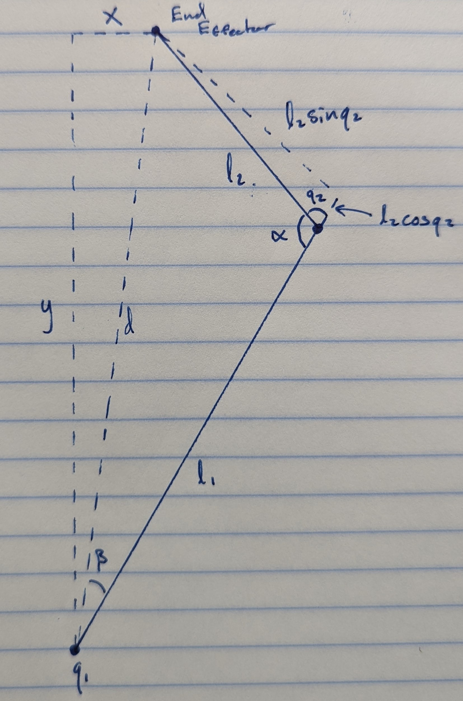

Inverse Kinematics Derivation
=============================

This shows how to derive the Inverse Kinematics for a 2-Link Planar Robot. This derivation solves for joint angles $`q_1`$ and $`q_2`$.

Diagram is shown at the end of this file

## Derivation

### Solve for $`q1`$

```math
\tan(q_1+\beta)=\frac{y}{x} \tag{1.1}
```


```math
q_1=\tan^{-1}(\frac{y}{x})-\beta\tag{1.2}
```

Where,

```math
\tan(\beta)=\frac{l_2\sin(q_2)}{l_1+l_2\cos(q_2)}\tag{1.3}
```

```math
\beta=\tan^{-1}\left( \frac{l_2\sin(q_2)}{l_1+l_2\cos(q_2)} \right)\tag{1.4}
```

We can now solve for $`q_1`$,

```math
q_1=\tan^{-1}(\frac{y}{x})-\tan^{-1}\left( \frac{l_2\sin(q_2)}{l_1+l_2\cos(q_2)}\right) \tag{1.5}
```
### Solve for $`q2`$

Firstly, we know:

```math
d^{2}=x^{2}+y^{2}\tag{2.1}
```

and using the law of cosines:

```math
d^{2}=l^{2}_{1}+l^{2}_{2}-2l_1l_2\cos(\alpha)\tag{2.2}
```

Therefore,

```math
\cos(\alpha)=\frac{-d^2+l^{2}_1+l^{2}_2}{2l_1l_2} \tag{2.3}
```


We also know that,

```math
q_2=\pi-\alpha\tag{2.4}
```

So, from trigonometry, we can use the following: 

```math
\cos(q_2)=\cos(\pi-\alpha)\tag{2.5}
```

```math
\cos(q_2)=\cos(\pi)\cos(\alpha)+\sin(\pi)\sin(\alpha)\tag{2.6}
```

Therfore,

```math
\cos(\alpha)=-\cos(q_2)\tag{2.7}
```

and plugging into equation (2.3) we get:

```math
\cos(q_2)=\frac{d^2-l^{2}_1-l^{2}_2}{2l_1l_2} \tag{2.8}
```

```math
q_2=
\begin{Bmatrix}
\pi-\cos^{-1}\left(\frac{-d^2+l^{2}_1+l^{2}_2}{2l_1l_2}\right)\\
\cos^{-1}\left(\frac{d^2-l^{2}_1-l^{2}_2}{2l_1l_2}\right)
\end{Bmatrix}
```

Finally, we can define $`q_2`$ as the following:

```math
q_2=
\begin{Bmatrix}
\pi-\cos^{-1}\left(\frac{l^{2}_1+l^{2}_2-x^2-y^2}{2l_1l_2}\right)\\
\cos^{-1}\left(\frac{x^2+y^2-l^{2}_1-l^{2}_2}{2l_1l_2}\right)
\end{Bmatrix}
```

We have two solutions because the elbow joint would be able to bend "inwards" or "outwards" if it wasn't for the constraint of the other arm attached at the End Effector. So we throw one of the solutions out; primarily the "outward" bent solution. Hence, we can define $`q_2`$ as:


```math
q_2=\cos^{-1}\left(\frac{x^2+y^2-l^{2}_1-l^{2}_2}{2l_1l_2}\right)
```

## Solution

```math
q = 
\begin{bmatrix}
\tan^{-1}(\frac{y}{x})-\tan^{-1}\left( \frac{l_2\sin(q_2)}{l_1+l_2\cos(q_2)}\right) \\
\cos^{-1}\left(\frac{x^2+y^2-l^{2}_1-l^{2}_2}{2l_1l_2}\right)
\end{bmatrix}
```

## Diagram


